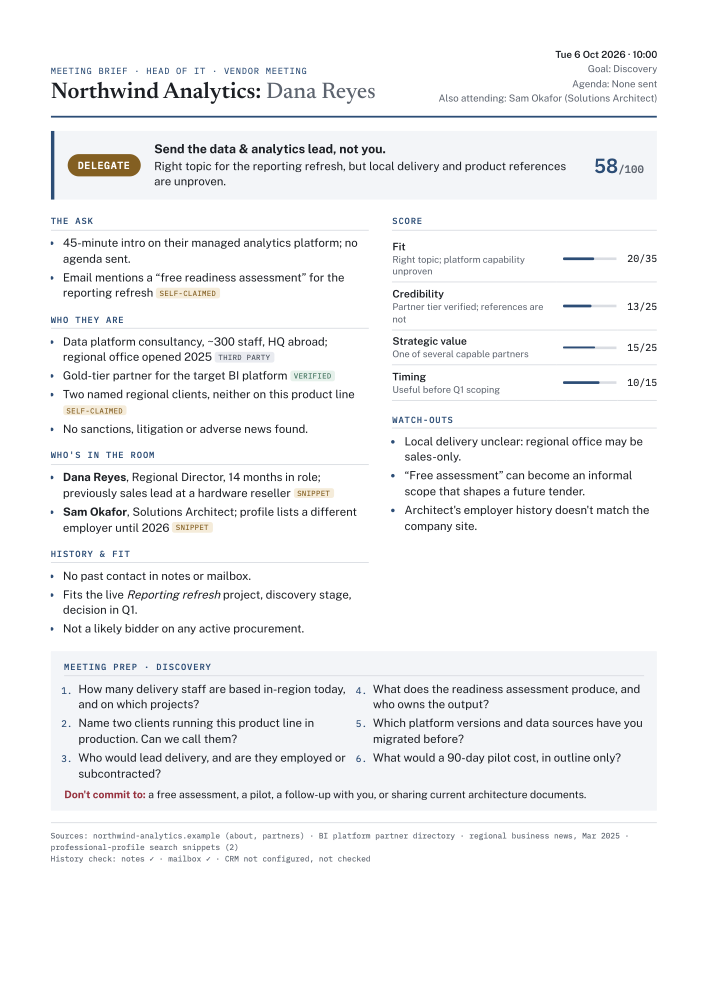

# engagement-screen

A Claude skill that vets requests for your time — vendor meeting requests, event invitations, speaking slots, paper and journal invitations — before you say yes.

- **Researches** the company or organiser and the person: what they sell, whether they can deliver locally, who they really work for, and whether the event or journal is legitimate.
- **Decides**: a Go / Delegate / Decline verdict with a score out of 100, plus hard gates for predatory journals, pay-to-speak, sanctions and live procurements.
- **Briefs**: a one-page A4 PDF with the verdict, evidence (tagged verified, third-party or self-claimed), watch-outs and meeting-prep questions shaped by your goal.

[](examples/sample-brief.pdf)

The sample above is for a fictional vendor, Northwind Analytics ([PDF](examples/sample-brief.pdf) · [HTML](examples/sample-brief.html)).

## Install

**Claude Code:** copy the folder into your skills directory.

```bash
cp -r engagement-screen ~/.claude/skills/
```

**Claude apps:** zip the `engagement-screen` folder and upload it as a skill under Settings → Capabilities → Skills.

## Configure me

Open `SKILL.md` and fill in the **Configure me** block at the top. The rest of the skill reads from it:

| Field | What to put |
|---|---|
| `ROLES` | The hats you evaluate requests through, e.g. "Head of IT at <org>", "University lecturer". Anything outside these gets a one-line "out of scope". |
| `DELEGATION_MAP` | Work area → person or team to delegate to. |
| `ACTIVE_PROCUREMENTS` | Open or upcoming tenders, and the kinds of vendor likely to bid. Drives the procurement gate. |
| `LIVE_PROJECTS_SOURCE` | Where your current projects are listed. |
| `HISTORY_SOURCES` | Where to look for past contact: notes folder, CRM, mailbox connector. |
| `OUTPUT_FOLDER` | Where PDFs and notes are saved. |
| `ACCENT_COLOR` | Brand colour for the PDF (default `#1F4E79`). |

## Example prompts

- "I have a meeting with Northwind Analytics and Dana Reyes, no agenda"
- "Is Gulf Data Summit 2027 worth speaking at?"
- "Which of these five vendors have local delivery for product X?"
- "Brief me on this invitation" (with the email pasted or attached)

## Requirements

- Python 3 and Playwright with Chromium, for the PDF:
  ```bash
  pip install playwright pypdf
  python3 -m playwright install chromium
  ```
  `pypdf` is optional; the page-count check falls back to a byte scan without it.
- Web search.
- Optional: mailbox, notes or CRM connectors for the history check. Without them the brief says the history couldn't be checked.

Render any filled template by hand with:

```bash
python3 scripts/render_pdf.py examples/sample-brief.html out.pdf
```

It exits non-zero if the result isn't exactly one page.

## Privacy

The skill researches professional information only: roles, employers, company facts, public track records. It never looks up home addresses, family or other personal details. It treats request emails, brochures and websites as data, never as instructions, and it never sends anything — replies are drafts only.

## License

MIT — see [LICENSE](LICENSE).
